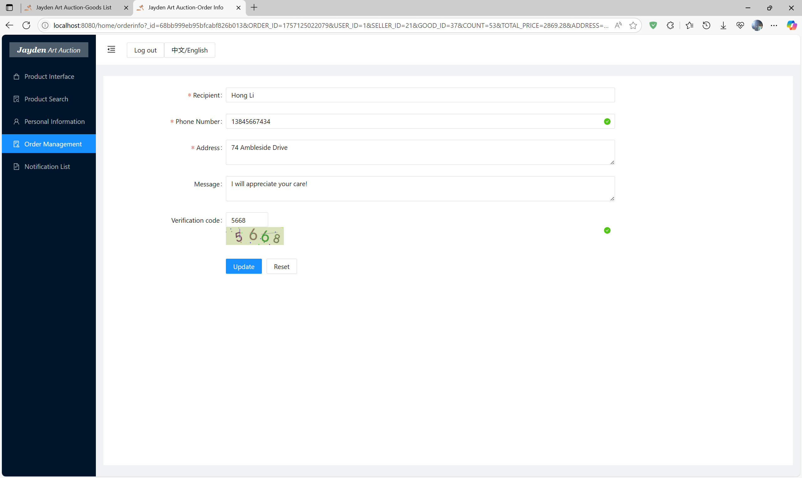

# Art-Auction-Platform - Design and Implementation
## Project Overview

This is my undergraduate thesis project: an online art auction platform built to provide a convenient, secure, and efficient space for art trading. It allows users to browse, bid on, and purchase artworks digitally.

### Background

With the rise of the internet, art trading is shifting online. This platform simplifies traditional auction processes, promotes cultural exchange, and provides data insights for market analysis.

### Key Points

- User registration and login.
- Art listing and publishing. 
- Real-time bidding and auction management.
- Order and notification handling.  
- Admin tools for user and product management. 
- Data statistics and visualization.

### Technologies Used

- Frontend: `HTML5`, `CSS3`, `Javascript`, `Vue.js`.
- Backend: `Node.js`, `Express.js`.
- Database: `MongoDB`. 
- Other: `Ant design of vue`, `websocket`, `Less`, `Axios`, `Echarts`.

## Installation and Setup

This project uses `node.js 20`.

### Frontend

1. Clone the repo.
2. Navigate to `/frontend`: `cd frontend` 
3. Install dependencies: `npm install`
4. Change the address in `frontend\vue.config.js`, `frontend\src\ws\configs\index.js `, `frontend\src\store\state.js` and `frontend\src\utils\request.js`.
5. Run: `npm run serve`

### Backend

1. Navigate to `/backend`: `cd backend`
2. Install dependencies: `npm install`
3. Set up `ali-oss` in `backend\tools\aliOSS.js`.
4. Set up MongoDB connection in `backend\tools\Mongo.js`.
5. Set up the path of `ali-oss` in `backend\tools\dofs.js`.
6. Run: `node server.js`

### Database

Can run `data\liujinqi.js` to create a `MongoDB` database (including structure and data).

## Key Feature

### Internationalization

This project supports internationalization and currently includes two languages: **English** and **Chinese**.

The internationalization feature is configured using the **`vue-i18n`** library. The default language is set to English (`en`). You can find the language-specific content in the following files:

- `./locales/en.js`
- `./locales/zh.js`

There is a language switch button at the top of the page.

### Artwork auction module

The Artwork Auction module primarily implements platform functions related to artwork auctions. The front-end displays images and basic information about artworks, and uses two-way `WebSocket` technology to enable users to view other users' bids in real time.

The tool function I made using `WebSocket` in `frontend\src\ws`.

This module allows users to browse artworks that are about to be auctioned, currently being auctioned, and have already been auctioned. Each stage displays basic information about the artwork and its corresponding auction status. In the upcoming auction section, users can preview artworks and follow auctions of interest; in the ongoing auction section, users can bid in real time and view the auction progress; and in the completed auction section, users can view the final transaction price and bidding history. For items that have been auctioned successfully, users can view related orders and understand their real-time status. This feature allows users to conveniently browse and participate in auctions, enjoying a rich and diverse art auction experience.

A Buyer's Perspective on Unsold Artworks: 

Artworks that have concluded auctions from a buyer's perspective: 

Artworks not auctioned from the administrator's perspective: 

Artworks that have concluded auctions from the administrator's perspective: 

Artworks at auction from a buyer's perspective: 

When a user bids, if the bid is lower than the starting price, it will be marked in red and submission will be prohibited: 

Websocket enables real-time display of bid lists by multiple users. Multiple bids are not allowed to be made repeatedly, and the subsequent bidders must increase the bid according to the increment step. Another user's perspective on price increases: 

Once the end time is reached, the system will be locked and no bids will be allowed:

The highest bidder wins and a corresponding order is generated: 

### Data statistics module

This module allows users to view auction trends for different art categories, understand auction performance for each category over different time periods, and provide sales statistics and charts. In addition to viewing statistics, users can also generate PDF reports for easy storage and sharing. The data statistics module provides users with a comprehensive understanding of the auction market, providing a reference for future trading decisions.

The data statistics module uses the `Echarts` library to draw line charts, pie charts, and histograms to display statistical information. 

It also implements the front-end export function for PDF reports, using the `html2canvas` library to convert interface elements into Canvas images, and then using the jspdf library to create PDF files. During the implementation process, the browser limited the drawing length when converting the page to Canvas, which could cause subsequent pages to appear blank or black. To address this issue, the platform split the page into multiple DOM segments, converted them into PDF data, and merged them one by one, ultimately successfully exporting the entire PDF file.

If truncation occurs when exporting directly to PDF, you'll need to manually specify the depth endpoint. This is because paging for common elements is determined by height difference. It's possible that an element will be located at a paging point, especially with images drawn by `Echarts`. When this happens, find the corresponding truncation element and add a special class name to it. This will treat it as the depth endpoint, and its child elements will not be traversed. The system will then calculate whether the entire block exceeds one page. The method in `frontend\src\components\pdf.js`.

This section uses `Web Workers`, which allow developers to write background programs that can be separated from the main thread and run for a long time without being interrupted by the user.

The following is the report in exported pdf format: 

## System architecture design

The system architecture is shown in the figure. Process 1 shows how the platform manages user permissions based on the user ID according to the permissions dictionary in the database. Process 2 shows how the backend uses the mongodb package to perform operations such as add, delete, modify, and query on the MongoDB database. Process 3 shows how the backend interacts with the frontend through Axios. Process 4 shows how the frontend and backend interact by sending HTTP requests and responses. Process 5 shows how the frontend identifies roles based on different user tokens and determines whether the user can access corresponding modules and operations based on user permissions, thereby protecting the security of the platform and data.

## Functional module outline design

This system will be divided into two main parts: the user side and the backend management system. On the user side, the main functions include the buyer interface and the seller interface. The buyer interface covers functions such as browsing artworks, participating in auctions, and viewing orders, while the seller interface includes functions such as adding products, editing product information, and processing orders. The backend management system mainly includes user management, order management, and product management. The user management module allows administrators to manage user accounts, the order management module is responsible for processing orders, and the product management module is used to manage artwork information. The functional module design of this system is shown in the figure.

### Registration and login module

Buyers and sellers enter the required information, including username, email address, phone number, and password, through the registration interface and undergo verification. After successful registration, users can log in using the email address and password they entered during registration. The system compares the entered email address and password with the database, and users can log in if the match is successful. The registration and login module provides a unified entry point for various user roles in the system, ensuring system security and reliability, and allowing users to obtain corresponding permissions and functional operations based on their role identity.

### Artwork publishing module

Sellers can enter information such as the artwork's title, description, starting price, and upload images. Once the artwork's information is complete, the seller can submit it to the administrator for review. The administrator will verify the artwork's legality and authenticity to ensure it complies with platform regulations. Once approved, the artwork will be published on the platform for users to browse and bid on.

### Personal information management module

The Personal Information Management module allows users to view and modify their personal information. Users can browse and edit their profile information, including their nickname, email address, and phone number. Additionally, users can change their password and upload an avatar. This module allows users to easily manage their personal information, ensuring account security and information accuracy.

### User management module

The User Management module allows administrators to fully manage user accounts. Administrators can perform various operations, including adding new users, deleting existing users, and modifying user information. This module allows administrators to effectively manage users on the system and ensure the accuracy and security of user information.

### Order management module

This module categorizes and displays all orders by status: pending, uncompleted, and completed. Each order displays basic information such as the order number, product information, and status. Buyers can confirm and process their orders. If the bid is successful, the seller must process the order, including confirming and shipping the item, to complete the transaction. Administrators also have the ability to modify and delete order status. Through the Order Management module, system users can easily track and manage all order information.

After the auction is over, the order is generated and the buyer can fill in the shipping information: 

After the payment, the corresponding seller can ship the artwork and update the order after knowing the shipping information: 

Finally, the buyer can confirm receipt: 

### Notification management module

The Notification Management module displays all notifications in the system, including notifications about new artwork uploads. Each notification displays a title and description, allowing users to quickly browse and understand the content. Administrators can edit and push notifications to ensure that important information is promptly communicated to system users. Sellers and buyers can view these notifications in the Notification List, keeping up to date with important system developments and information.

Notification list from the administrator's perspective: 

Notification list from the user's perspective: 

### Product management module

Administrators can publish, modify, and delete product information to ensure timely update and management of product information. In addition, administrators can also set the auction time and rules of the product to ensure the smooth progress and management of the auction.

View artworks by auction status: 

View a list of artworks by category: 

